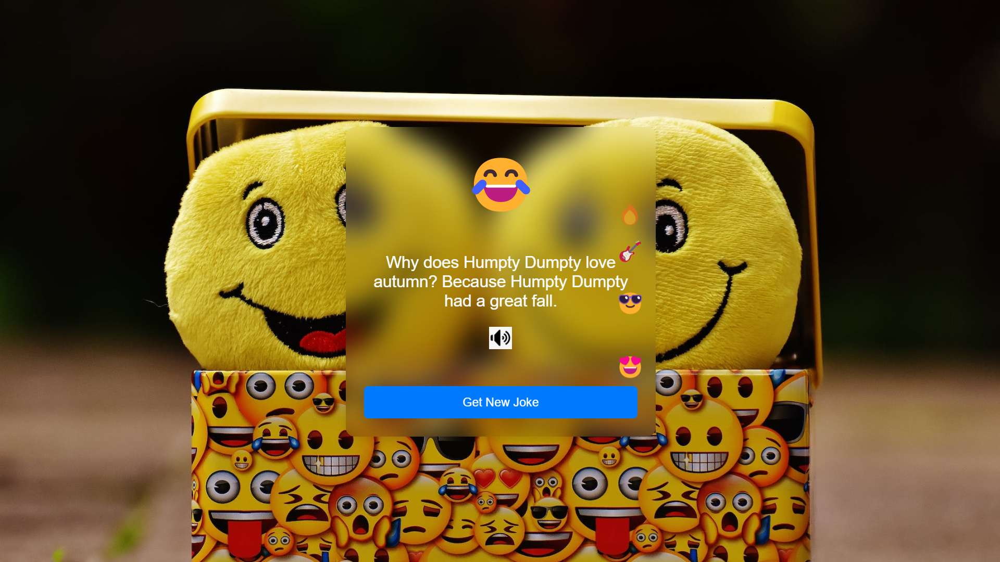

# Instant Laughter Generator

Welcome to the Instant Laughter Generator, your source of instant joy and laughter!

## Description

This web application provides a collection of random jokes to bring a smile to your face. Click the "Get New Joke" button to enjoy a fresh dose of humor. You can even listen to the jokes being spoken out loud by clicking the speaker icon!

## Page

## Technologies Used

- HTML
- CSS
- JavaScript

## How to Use

1. Open the `index.html` file in your web browser.
2. Click the "Get New Joke" button to receive a random joke.
3. To hear the joke spoken aloud, click the speaker icon.

## Project Structure

- `index.html`: Main HTML file for the web application.
- `styles.css`: Stylesheet for the application's layout and design.
- `script.js`: JavaScript file containing logic for random joke generation and emoji animation.

## Jokes Data

The application uses an array of jokes stored in the `jokes` array in the `script.js` file.

## Live Demo

For a live demo, visit [Random Joke Generator](https://randomm-joke.netlify.app/).

## Contributing

If you'd like to contribute or add more jokes, feel free to create a pull request. Your humor is always welcome!
